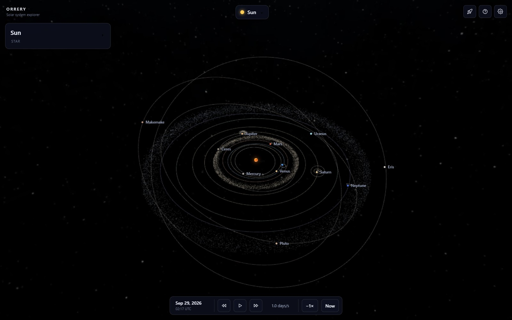

# Orrery

An interactive 3D model of the solar system built with [three.js](https://threejs.org/). Explore planets and moons, change the date, take a guided tour, or fly around in flight mode. You can also explore other star systems using data from the [NASA Exoplanet Archive](https://exoplanetarchive.ipac.caltech.edu/).

Visit the [GitHub Pages site](https://jarvisar.github.io/orrery/) to access the latest deployment. The site can be installed from your browser and works offline. There is also a desktop app for Windows, macOS and Linux.



## Usage

Click on a planet or moon to focus on it. Drag to rotate the camera and scroll to zoom. Click on the date to change it, or press Space to pause.

- **Tours** takes you through a few groups of planets and moons.
- **Star systems** lets you search for and explore exoplanet systems.
- **G** switches to flight mode. Click to capture the mouse, use W/S for the throttle, A/D to roll and Shift to boost. Press Esc to exit.
- **H** returns to the overview.
- **?** shows the full list of controls.

Game controllers and VR headsets are also supported. See [controls](docs/controls.md) for the full list.

Positions and rotations use real orbital data, but sizes and distances are compressed so everything is easier to see. Positions are most accurate between 1800 and 2050. Exoplanet systems are built from the available measurements, so their orbital positions and surfaces are only illustrative. See the [accuracy notes](docs/development.md#accuracy) and [exoplanet notes](docs/exoplanets.md) for more details.

## Local Installation

Node.js and npm are required. Clone the repository, then run:

```sh
npm install
npm run dev
```

Open [localhost:5173](http://localhost:5173). There is no build step.

To run the checks:

```sh
npm run check
npm run smoke
```

The smoke test requires a local installation of Chrome. See the [development notes](docs/development.md) for the other checks and how the site is deployed.

## Desktop App

The desktop app is built with Electron and runs on Windows, macOS and Linux, including the Steam Deck. Download it from [Releases](https://github.com/jarvisar/orrery/releases), or run it locally:

```sh
npm run desktop:setup
npm run desktop
```

See [desktop/README.md](desktop/README.md) for installing, building and releasing.

## Credits

- Planet and moon textures from [Solar System Scope](https://www.solarsystemscope.com/textures/) and NASA/JPL imagery
- Phobos and Deimos models from NASA's 3D resources
- Star data from the [Yale Bright Star Catalogue](http://tdc-www.harvard.edu/catalogs/bsc5.html) (Hoffleit & Warren, 1991)
- Pole and rotation data from the IAU WGCCRE reports (Archinal et al.)
- Exoplanet data from the [NASA Exoplanet Archive](https://exoplanetarchive.ipac.caltech.edu/)
- Binary and multiple star data from the [Open Exoplanet Catalogue](https://github.com/OpenExoplanetCatalogue/open_exoplanet_catalogue) (MIT, license in `public/data/`)
- Exoplanet appearances, habitable zones and dust disks from the published studies cited in the info panel (see [how they look](docs/exoplanets.md#how-they-look))
- [Inter](https://github.com/rsms/inter) and [Jost](https://github.com/indestructible-type/Jost) fonts (SIL Open Font License, licenses in `public/fonts/`)
- three.js (MIT, license in `vendor/three/`)
