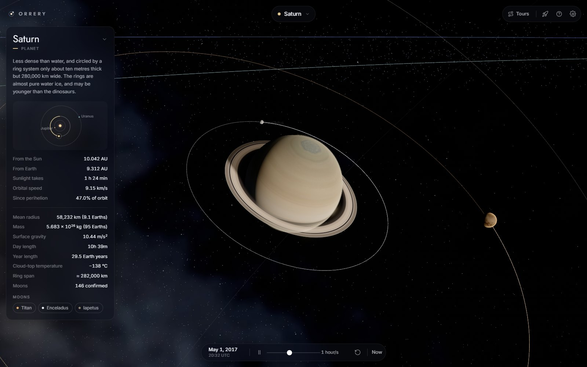
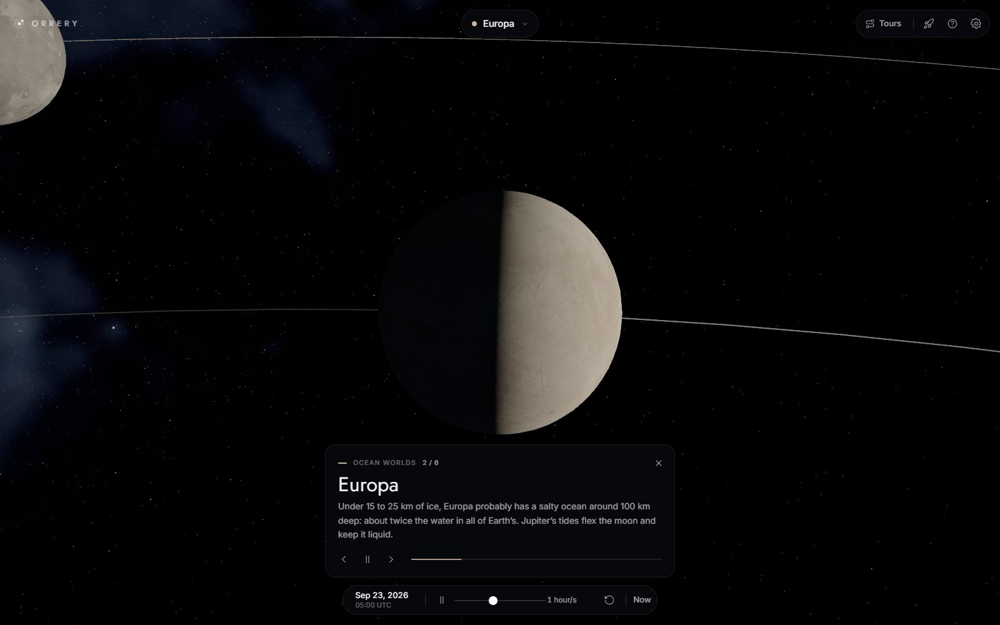

# Orrery

An interactive 3D model of the solar system, built with [three.js](https://threejs.org/).

**[Open it →](https://jarvisar.github.io/orrery/)**

Every body is placed by solving Kepler's equation against its real J2000 orbital
elements, and turned on its real axis to its real rotation, so what you see is
roughly where things actually are - and which side of Earth is in daylight - on
the date shown in the time bar. The stars behind it are the real ones. Sizes and
distances are compressed - a true-to-scale solar system is mostly empty space
with sub-pixel planets in it - but every length goes through the same power
law, so the ordering and proportions survive it. Pluto still ducks inside
Neptune's orbit near perihelion.

Contains the Sun, eight planets, eleven moons, four dwarf planets, the asteroid
and Kuiper belts, and 9,096 catalogued stars.


## Using it

Click any body to focus it, or pick one from the menu at the top. When bodies
are too small to see, labelled markers fade in - click those instead. The info
panel carries a live map of the body's neighbourhood, and links to its moons.

**Tours** fly you round the system one stop at a time, with a caption at each:
*The Grand Tour* (Sun to Pluto), *Ocean Worlds*, and *Odd Ones Out*.

**Click the date** to go anywhere in time - a date of your own, or one of a
handful of moments worth seeing, like the 2020 great conjunction or Saturn's
2025 equinox, when its rings go dark. Jumps sweep through time rather than cut,
and the address bar keeps the date, so a link takes someone to the same moment.

| | |
| --- | --- |
| **Drag** / **scroll** | Orbit and zoom |
| **Click** | Focus a body |
| **H** | The whole system (or click the wordmark) |
| **T** | Choose a tour; **←** / **→** step through it |
| **Esc** | Free view, or leave a tour or flight mode |
| **`[`** / **`]`** | Previous / next body |
| **Space** | Play or pause time |
| **`,`** / **`.`** | Slow down / speed up time (or drag the rate slider) |
| **R** / **N** | Reverse time / jump to now |
| **G** | Flight mode |
| **?** | Full list of controls |

In flight mode, **W**/**S** work the throttle, **A**/**D** roll, the mouse steers,
**Shift** boosts and **Space** is a full stop.

Links take `?body=saturn` and `?t=2017-05-01` (any ISO date or date-time, UTC).



## Running it locally

```sh
npm install     # three.js, plus the tools used to rebuild assets
npm run dev     # http://localhost:5173
```

There is no build step. `npm run dev` serves the repository as-is, so what you
see locally is byte-for-byte what gets deployed.

```sh
npm run check   # syntax, vendored three.js, every texture, model, font and link
npm run smoke   # loads the real page in headless Chrome, runs a tour and a time jump
npm run responsive  # layout and accessibility at ten screen sizes, 320px to 1080p
npm run vendor  # re-copy three.js out of node_modules after a version bump
```

Because nothing is bundled, `npm run check` stands in for the errors a bundler
would normally catch: a stale vendored three.js, or a texture named in the
catalogue that is not actually shipped. `npm run smoke` catches the rest, by
loading the page, driving it, and failing on any uncaught error, failed
request or loading screen that never lifts. It uses whatever Chrome is already
installed and skips itself if there is none. `npm run responsive` opens every
panel at each of ten common screen sizes and fails if anything runs off screen,
overlaps, wraps or clips, if a control is too small to tap, if Tab reaches a
control without a visible focus ring, if text on a plate falls below 4.5:1
contrast, or if axe-core finds a WCAG 2.2 AA violation. Pass `--shots=dir` to
keep a screenshot of every size and state. Add `?debug` to the URL to get the
scene, camera and clock on `window.orrery` in the console.

## Deploying

`.github/workflows/deploy.yml` publishes to GitHub Pages on every push to
`main`. It runs the checks, stages only the files that are actually served, and
uploads them - there is nothing to compile.

**One-time setup:** in the repository, go to *Settings → Pages* and set
**Source** to **GitHub Actions**. Until that is switched over, the workflow will
run but the deployment step will fail.

`.github/workflows/ci.yml` runs the same checks on pull requests and on pushes
to other branches.

## How it is put together

```
src/
  data/bodies.js       every measurement, in real units - the catalogue
  data/tours.js        the guided tours, stop by stop
  data/moments.js      the dates in the "go to" list
  sim/                 Kepler solver, reference frames, the simulation clock
  scene/               bodies, orbits, belts, the sky, atmospheres, shader patches
  camera/              focus and framing, the overview, free flight
  core/                renderer, post-processing, asset streaming, settings, picking
  ui/                  every panel, built in JS so each owns its own markup
vendor/three/          three.js, vendored - see below
public/                textures, models, fonts, the star catalogue
scripts/               dev server, checks, asset pipeline, vendoring
```

`src/data/bodies.js` is the only place any number about a real object lives.
Adding a body means adding an entry and a texture; nothing else needs to change.
`src/scene/scaling.js` is the only place those real units become scene units,
and `src/sim/frames.js` the only place equatorial coordinates become scene axes.

### How it is drawn

The scene renders in HDR into a half-float target, then goes through bloom and
one finishing pass (`src/core/Post.js`) that tone maps the whole frame with
AgX, darkens the corners very slightly and dithers - the Milky Way and the glows
are long, faint gradients, which is exactly where 8-bit banding shows. It can
be switched off in Settings.

- **Atmospheres** are a single additive shell per body that draws both the
  halo beyond the limb and the haze thickening toward it, lit from the Sun's
  side with a little forward scattering, so a crescent Earth keeps a blue rim
  (`src/scene/atmosphere.js`).
- **Thick atmospheres** also soften the terminator into a twilight band;
  airless bodies keep a hard one.
- **The Sun** is limb-darkened and written well above white, so the tone
  mapper and bloom treat it as a light source rather than an orange ball.
- **Orbit paths** fade back from the body like a long exposure, so direction of
  travel reads without arrows.
- Small shader edits to three's built-in materials go through one helper,
  `src/scene/shading.js`, so several can share a material and its compiled program.

### three.js is vendored, not fetched

`vendor/three/` holds the exact three.js files the app imports, copied out of
`node_modules` by `scripts/vendor.js` and mapped in through an import map. The
page loads nothing from a third-party CDN at runtime; the two typefaces, Inter
and Jost, are self-hosted in `public/fonts/`.

To upgrade, bump `three` in `package.json` and run `npm run vendor`.

### Assets

Textures under `public/textures/` and models under `public/models/` are built
from the original source art by `scripts/optimize-textures.py` and
`gltf-transform`. The originals are not in the working tree; they are in the
git history if you need them.

The pipeline exists because the original art was 185 MB. An 8192×4096 bump map
costs 179 MB of VRAM once it is uploaded with mipmaps, and several of them were
being used on moons drawn eight pixels across. Sizes are now chosen from how
large each body actually renders.

Saturn's rings are stored as a 1024×1 radial strip rather than a 2048² sheet -
the rings only vary with radius, so the ring geometry carries a radial `U`
coordinate and the texture stores that one profile once. 4.5 MB became 1.7 KB.

**The sky** is built by `scripts/build-sky.py` from two sources: the original
8K Milky Way panorama (`git show cb92b48^:public/8k_stars_milky_way.jpg`) and
the Yale Bright Star Catalogue (`bsc5.dat`). The panorama is in galactic
coordinates, stored south-up, with its stars painted in as soft blobs; the
script strips out the stars, keeps the glow and the dust lanes, and reprojects
what is left into the scene's own ecliptic frame, so it needs no rotation at
runtime. The catalogue's 9,096 stars - everything to magnitude 6.5 - are packed
at 8 bytes each into `public/data/stars.bin`, with 14,000 fainter ones drawn
from the glow to give the band texture. At runtime they are points, a fixed
number of pixels across, so they stay sharp at any zoom.

```sh
python scripts/build-sky.py 8k_stars_milky_way.jpg bsc5.dat
```

## Notes on what is and is not accurate

- **Positions** use the J2000 elements from JPL's *Keplerian Elements for
  Approximate Positions of the Major Planets*, valid 1800–2050. Outside that
  range they drift. Dwarf-planet and satellite elements are mean values and are
  good enough to put a body on the right side of its primary, not to navigate by.
- **Orientation and rotation** come from the IAU Working Group on Cartographic
  Coordinates and Rotational Elements: each pole's direction, and where the
  prime meridian stood at J2000. Earth's axis points at Polaris, the seasons
  fall in the right months, and the day side is the real one - at noon UTC on
  the June solstice the Sun stands over 23.4°N, 0.5°E. Venus, Uranus and Pluto
  turn backwards, and Triton orbits backwards.
- **Eccentricity, inclination and axial tilt** are real. Every moon here is
  tidally locked and keeps one face toward its planet. The Moon's phase is right
  to within about a day; its elements leave out the slow swing of its perigee.
- **Sizes and distances** all go through one power law,
  `units = 24 × (km / Earth radius) ^ k`, defined in `src/scene/scaling.js`.
  Radii, orbits, moon distances and rings use the same `k`, so every ratio of
  two lengths is compressed the same way and nothing is tuned per category. The
  **Scale** setting is `k`: higher is closer to true proportions, with smaller
  bodies and wider orbits.
- **Moon orbits** are measured from their planet's equator, so Saturn's moons
  share the plane of its rings. The Moon, whose elements are referred to the
  ecliptic, is the one exception.
- **Stars** are in their J2000 positions; proper motion is ignored, which is
  invisible over the range the elements are valid for.
- **Lighting** uses a point light with distance falloff disabled. Real
  inverse-square falloff leaves everything past Jupiter in the dark.
- **Saturn's rings** are lit by how high the Sun stands above them, so they
  darken toward an equinox, and seen from the unlit side they show the light
  that filters through. Their shadows - rings onto Saturn, and Saturn onto its
  rings - are solved analytically in the shader rather than with a shadow map.
  A point light's cube shadow map has about ten texels across a planet at
  Saturn's distance, which is enough to produce shadow acne and nothing else.
  The optional shadow map in Settings is off by default for the same reason.



## Credits

Planet and moon textures from [Solar System Scope](https://www.solarsystemscope.com/textures/)
and NASA/JPL imagery. Phobos and Deimos models from NASA's 3D resources. Stars
from the Yale Bright Star Catalogue, 5th revised edition (Hoffleit & Warren,
1991), via the [Harvard SAO Telescope Data Center](http://tdc-www.harvard.edu/catalogs/bsc5.html).
Pole and rotation data from the IAU WGCCRE reports (Archinal et al.).
[Inter](https://github.com/rsms/inter) and [Jost](https://github.com/indestructible-type/Jost)
are under the SIL Open Font License; their licences are in `public/fonts/`.
three.js is MIT licensed; its licence travels with the vendored copy.
